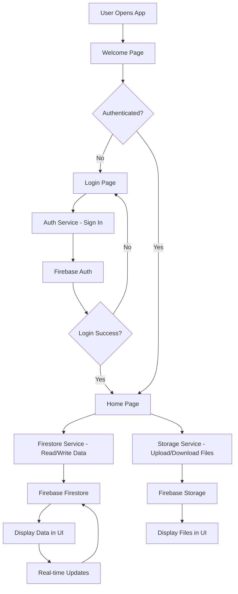

# SafeGate App Architecture

## System Overview

### Tech Stack
- **Frontend**: Flutter (Dart) for cross-platform mobile app development
- **Backend Services**: Firebase (Auth, Firestore, Storage, Cloud Functions)
- **Other Tools**: Postman for API documentation, Git for version control

### High-Level Architecture
The SafeGate app follows a client-server architecture where the Flutter app communicates with Firebase services:
- **App Layer**: User interface and business logic
- **Service Layer**: Firebase integrations (Auth, Firestore, Storage)
- **Data Layer**: Cloud storage and real-time database

```
[Flutter App] <--> [Firebase Services]
     |                |
     v                v
[User Interface]  [Auth | Firestore | Storage]
```

## Directory Structure

```
lib/
├── main.dart              # App entry point
├── screens/               # UI screens
│   ├── welcome_page.dart  # Welcome screen with state management
│   ├── home_page.dart     # Home screen for authenticated users
│   ├── login_page.dart    # Login interface
│   └── responsive_home.dart # Responsive home layout
├── widgets/               # Reusable UI components (future use)
├── models/                # Data structures (future use)
├── services/              # Business logic and Firebase integrations
│   ├── auth_service.dart      # Firebase Authentication
│   ├── firestore_service.dart # Firestore database operations
│   └── storage_service.dart   # Firebase Storage
└── utils/                 # Utility functions (future use)
```

## Data Flow / System Diagram



### Data Flow Explanation
1. **Authentication Flow**: User logs in via `AuthService` → Firebase Auth → Token stored for API calls
2. **Data Operations**: `FirestoreService` handles CRUD operations → Firestore database → Real-time sync to UI
3. **File Operations**: `StorageService` manages uploads/downloads → Firebase Storage → Files displayed in app
4. **State Management**: UI updates reactively to Firebase changes

## Firebase Setup and Integration

### Firebase Products Used
- **Firebase Auth**: User authentication (email/password)
- **Firestore**: NoSQL database for user data and app content
- **Firebase Storage**: File uploads (images, documents)

### Authentication Process
1. User enters credentials in `LoginPage`
2. `AuthService.signIn()` calls Firebase Auth
3. On success, ID token is stored and used for subsequent API calls
4. Auth state is monitored to show appropriate screens

### Data Read/Write Operations
- **Reading**: `FirestoreService.getUserData()` fetches documents from Firestore
- **Writing**: `FirestoreService.saveUserData()` creates/updates documents
- **Real-time**: Firestore listeners update UI automatically on data changes

### Security Rules
- Firestore rules ensure users can only access their own data
- Storage rules restrict file access to authenticated users
- Example Firestore Rule:
  ```
  match /databases/{database}/documents {
    match /users/{userId} {
      allow read, write: if request.auth != null && request.auth.uid == userId;
    }
  }
  ```

## Deployment and Maintenance

### Build and Deployment
1. **Development**: `flutter run` for local testing
2. **Build**: `flutter build apk` or `flutter build ios` for mobile
3. **Web Deployment**: `flutter build web` → Firebase Hosting
4. **App Store**: Submit builds to Google Play Store / Apple App Store

### Configuration
- **Environment Variables**: Store Firebase config in `.env` file
- **Firebase Setup**: 
  - Download `google-services.json` (Android) / `GoogleService-Info.plist` (iOS)
  - Place in appropriate platform folders
  - Initialize Firebase in `main.dart`

### Documentation Update Checklist
- [ ] Update API documentation for new endpoints
- [ ] Add new screens/widgets to directory structure
- [ ] Update data flow diagram if architecture changes
- [ ] Version bump in metadata for breaking changes
- [ ] Test all Firebase integrations after updates

## Version Information
- **Version**: 1.0.0
- **Last Updated**: 2025-11-13
- **Base URL**: https://your-app.firebaseapp.com
- **Auth Type**: Firebase Token / OAuth