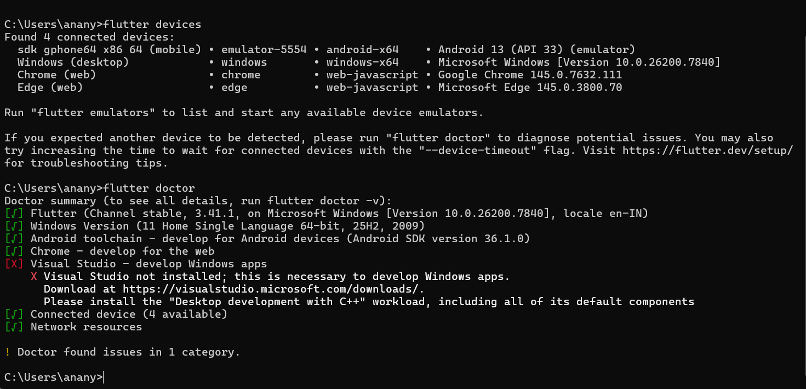
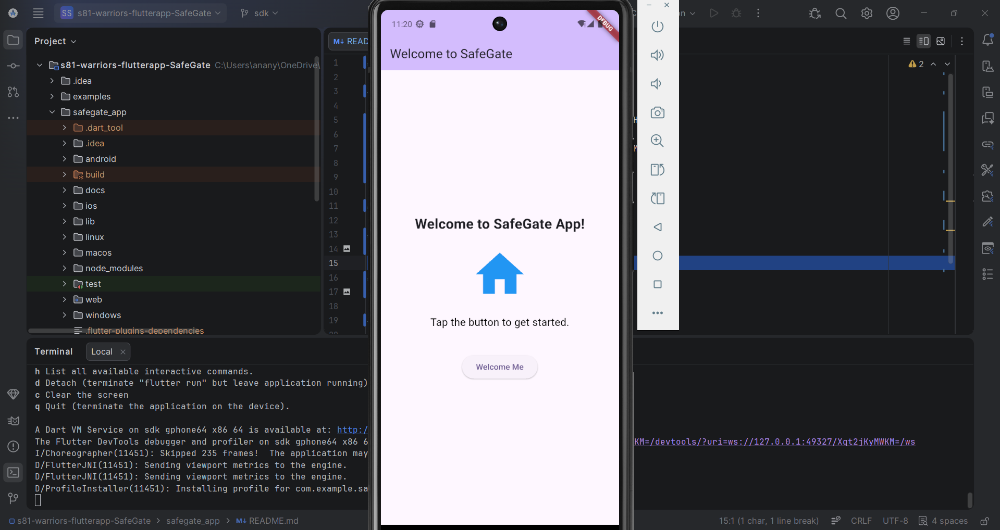

# Flutter Environment Setup and First App Run

## Steps Followed

1. Installed Flutter SDK and added it to system PATH.
2. Installed Android Studio and Android SDK.
3. Created and launched Android Emulator using AVD Manager.
4. Ran Flutter Doctor to verify setup.
5. Ran an existing Flutter app on the emulator.

## Setup Verification

### Flutter Doctor Output

### Running Flutter App on Emulator

## Reflection

During the setup, I faced challenges such as downloading Android system images and configuring the Android SDK path. After resolving these issues, Flutter Doctor showed a healthy environment. This setup prepares me to build, test, and debug real mobile applications efficiently using an emulator or physical device.