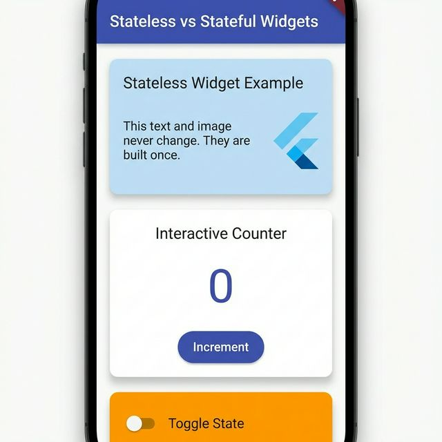

# Flutter Environment Setup and First App Run

## Steps Followed

1. Installed Flutter SDK and added it to system PATH.
2. Installed Android Studio and Android SDK.
3. Created and launched Android Emulator using AVD Manager.
4. Ran Flutter Doctor to verify setup.
5. Ran an existing Flutter app on the emulator.

## Setup Verification

### Flutter Doctor Output


### Running Flutter App on Emulator


## Reflection

During the setup, I faced challenges such as downloading Android system images and configuring the Android SDK path. After resolving these issues, Flutter Doctor showed a healthy environment. This setup prepares me to build, test, and debug real mobile applications efficiently using an emulator or physical device.

# Widget Tree Demo App

## Project Title
Widget Tree and Reactive UI Demo

## Short Description
This demo app illustrates the concept of the widget tree in Flutter and demonstrates the reactive UI model through interactive state changes. It features a simple counter with buttons to increment the count and change the background color, showcasing how Flutter rebuilds only the affected parts of the UI.

## Widget Tree Hierarchy

```
MaterialApp
┣ Scaffold
  ┣ AppBar
  ┃ ┗ Text ('Widget Tree Demo')
  ┗ Center
    ┗ Column
      ┣ Text ('Count:')
      ┣ Text ('$count')
      ┣ SizedBox
      ┣ ElevatedButton ('Increment')
      ┃ ┗ Text ('Increment')
      ┣ SizedBox
      ┗ ElevatedButton ('Change Background Color')
        ┗ Text ('Change Background Color')
```

## Screenshots

### Initial UI State


### Updated UI After State Change


## Explanations

### What is a Widget Tree?
In Flutter, the widget tree is a hierarchical structure where every element of the UI is a widget. Widgets are the building blocks of the Flutter UI, and they form a tree with parent-child relationships. The root is typically the MaterialApp or CupertinoApp, and it branches out to various layout and UI widgets like Scaffold, Column, Text, etc. Each widget can have children, creating a nested structure that defines the entire user interface.

### How Does the Reactive Model Work in Flutter?
Flutter's UI is reactive, meaning it automatically updates the UI when the underlying data (state) changes. Instead of manually redrawing the entire screen, Flutter uses a declarative approach where you describe what the UI should look like based on the current state. When state changes (e.g., via setState()), Flutter rebuilds the widget tree, but only the parts that depend on the changed state are actually re-rendered. This is efficient because Flutter compares the old and new widget trees and updates only the differences.

### Why Does Flutter Rebuild Only Parts of the Tree and Not the Entire UI?
Flutter rebuilds only the affected parts of the widget tree to optimize performance. When setState() is called, it marks the widget as needing a rebuild. During the build process, Flutter creates a new widget tree and compares it to the previous one using a process called "reconciliation." Only the widgets that have changed are updated in the actual render tree, minimizing the work needed to update the UI. This s
# Stateless vs Stateful Widgets Demo

## Project Title
SafeGate: Stateless and Stateful Widgets Exploration

## Short Description
This demo showcases the two fundamental widget types in Flutter: `StatelessWidget` and `StatefulWidget`. It illustrates how static UI components are defined and how interactive elements manage mutable state to update the UI dynamically.

## Code Snippets

### StatelessWidget Implementation
```dart
class HeaderBannerWidget extends StatelessWidget {
  final String title;
  final String subtitle;
  final Color color;

  const HeaderBannerWidget({
    super.key,
    required this.title,
    required this.subtitle,
    required this.color,
  });

  @override
  Widget build(BuildContext context) {
    return Container(
      padding: const EdgeInsets.all(20),
      // ... UI definition
    );
  }
}
```

### StatefulWidget Implementation
```dart
class InteractiveCounterWidget extends StatefulWidget {
  @override
  State<InteractiveCounterWidget> createState() => _InteractiveCounterWidgetState();
}

class _InteractiveCounterWidgetState extends State<InteractiveCounterWidget> {
  int _count = 0;

  void _incrementCount() {
    setState(() {
      _count++;
    });
  }

  @override
  Widget build(BuildContext context) {
    return Column(
      children: [
        Text('$_count'),
        ElevatedButton(onPressed: _incrementCount, child: Text('Increment')),
      ],
    );
  }
}
```

## Screenshots

### Initial UI State


### Updated UI After State Change


## Reflection

### How do Stateful widgets make Flutter apps dynamic?
Stateful widgets maintain internal data (state). When this data changes and `setState()` is called, Flutter rebuilds the widget's subtree. This allows the app to react to user inputs, data from APIs, or timer events, making the interface feel alive and interactive.

### Why is it important to separate static and reactive parts of the UI?
1. **Performance**: Flutter is highly optimized, but rebuilding fewer widgets is always better. By keeping static parts in `StatelessWidgets`, we prevent unnecessary rebuilds.
2. **Predictability**: It's easier to debug code when you know exactly which components are responsible for state management.
3. **Clarity**: Separating logic from presentation makes the codebase more readable and maintainable.

### When should you prefer Stateless widgets?
Use `StatelessWidgets` for any UI that depends solely on its constructor arguments (configuration) and does not need to change during its lifecycle. Examples include icons, static text, banners, and layout containers.

### When are Stateful widgets necessary?
Use `StatefulWidgets` when the UI needs to change based on internal interactions (like a form field, a counter, or a character animation) or external events (like a data stream) that happen after the widget has been created.

### How does Flutter rebuild only the widgets that change?
Flutter uses a "reconciliation" algorithm during the build phase. When `setState()` is called, the widget is marked as "dirty". During the next frame, Flutter compares the new widget tree with the old one. It only updates the render objects that correspond to the changed widgets, ensuring high-efficient UI updates.

---

# Flutter DevTools, Hot Reload & Debug Console Guide

## Project Title
SafeGate: DevTools, Hot Reload & Debugging Demo

## Short Description
This documentation covers Flutter's powerful development tools that accelerate the development workflow. Learn how to use Hot Reload for instant UI updates, the Debug Console for real-time logging, and Flutter DevTools for debugging and performance profiling.

---

## 1. Hot Reload Feature

### What is Hot Reload?
Hot Reload allows you to instantly apply code changes to a running app without restarting it. This feature significantly speeds up UI iteration and testing while preserving your app's current state.

### How to Use Hot Reload

**In VS Code:**
- Press `r` in the terminal where your app is running
- Use the "Hot Reload" button in the top toolbar
- Use keyboard shortcut: `Ctrl+Shift+F5`

**In Android Studio:**
- Click the Hot Reload button (⚡ icon) in the toolbar
- Use keyboard shortcut: `Ctrl+S` (Windows) / `Cmd+S` (macOS)

**From Terminal:**
- Press `r` while the `flutter run` command is active

### Hot Reload Example Workflow

```dart
// STEP 1: Run your app
// > flutter run

// STEP 2: Original code
Text('Hello, Flutter!');

// STEP 3: Make a change
Text('Welcome to Hot Reload!');

// STEP 4: Save the file → App updates INSTANTLY without losing state!
```

### Code Example with State Preservation

```dart
class DevToolsDemo extends StatefulWidget {
  @override
  State<DevToolsDemo> createState() => _DevToolsDemoState();
}

class _DevToolsDemoState extends State<DevToolsDemo> {
  int _tapCount = 0;  // This value is PRESERVED during Hot Reload!
  
  // HOT RELOAD DEMO: Try changing these values and saving!
  static const String appTitle = 'Hot Reload Demo';  // Try: 'Welcome!'
  static const Color primaryColor = Colors.indigo;   // Try: Colors.teal
  
  @override
  void didUpdateWidget(covariant DevToolsDemo oldWidget) {
    super.didUpdateWidget(oldWidget);
    debugPrint('🔄 Hot Reload detected! didUpdateWidget() triggered');
  }
  
  // ... widget build
}
```

### Hot Reload vs Hot Restart

| Feature | Hot Reload | Hot Restart |
|---------|------------|-------------|
| **Speed** | ~1 second | ~3-5 seconds |
| **State** | Preserved | Reset |
| **Use Case** | UI changes | Logic/initialization changes |
| **Terminal Key** | `r` | `R` |

### Screenshot Placeholder

*App showing instant UI changes after Hot Reload*

---

## 2. Debug Console for Real-Time Insights

### What is the Debug Console?
The Debug Console displays your app's logs, variable outputs, and error messages in real-time. It's essential for tracking runtime behavior and debugging issues.

### Using debugPrint()

```dart
void _incrementCount() {
  setState(() {
    _count++;
    // Debug statements for Debug Console
    debugPrint('🔢 Counter incremented! Current count: $_count');
    debugPrint('   Timestamp: ${DateTime.now()}');
  });
}

void _resetCount() {
  setState(() {
    _count = 0;
    debugPrint('🔄 Counter reset to 0');
  });
}
```

### debugPrint() vs print()

| Feature | `debugPrint()` | `print()` |
|---------|----------------|-----------|
| **Line wrapping** | Automatic | None |
| **Throttling** | Yes (prevents overflow) | No |
| **Best for** | Production debugging | Quick checks |

### Common Debug Console Uses
1. **Viewing Flutter framework logs and errors**
2. **Tracing app behavior with print statements**
3. **Checking widget lifecycle messages**
4. **Monitoring state changes**
5. **Debugging navigation flow**

### Debug Console Output Example

```
🚀 DevToolsDemo initialized
   Widget lifecycle: initState() called
🏗️ Building DevToolsDemo widget...
👆 Tap count updated to: 1
   setState() called - UI will rebuild
   Timestamp: 2026-02-27 14:30:45.123456
🔄 Hot Reload detected! didUpdateWidget() triggered
🏗️ Building DevToolsDemo widget...
```

### Screenshot Placeholder

*Debug Console showing real-time log output*

---

## 3. Flutter DevTools

### What is Flutter DevTools?
Flutter DevTools is a powerful suite of debugging and performance profiling tools for Flutter applications.

### How to Launch DevTools

**Option 1: From VS Code**
1. Run your app in debug mode
2. Open Command Palette (`Ctrl+Shift+P`)
3. Type "Open DevTools" and select it

**Option 2: From Terminal**
```bash
# Activate DevTools (one-time setup)
flutter pub global activate devtools

# Run DevTools
flutter pub global run devtools
```

**Option 3: From Chrome/Browser**
When running `flutter run`, a URL is displayed in the terminal. Open it in Chrome to access DevTools.

### Key DevTools Features

#### 📊 Widget Inspector
Visually examine your widget tree and modify UI components interactively.

**Features:**
- View complete widget hierarchy
- Select widgets to see their properties
- Debug layout issues (padding, margins)
- Highlight widget boundaries

**Use Case:** Understanding why a widget isn't rendering correctly or debugging overflow issues.

#### ⚡ Performance Tab
View frame rendering times and diagnose performance bottlenecks.

**Features:**
- Frame rendering timeline
- Identify janky frames
- See build, layout, and paint times
- Performance overlays

**Use Case:** Finding and fixing UI jank, optimizing animations.

#### 💾 Memory Tab
Analyze memory usage and detect leaks.

**Features:**
- Heap snapshots
- Memory allocation tracking
- Detect memory leaks
- Object lifecycle analysis

**Use Case:** Debugging memory issues, optimizing app memory footprint.

#### 🌐 Network Tab
Monitor API requests and responses.

**Features:**
- Track HTTP requests
- View request/response headers
- Inspect payload data
- Debug API integration issues

**Use Case:** Debugging Firebase connections, REST API calls.

### Screenshot Placeholders

*Flutter DevTools Widget Inspector view*


*Flutter DevTools Performance profiling*

---

## 4. Effective Development Workflow

### Combined Workflow Demo

1. **Start your app:**
   ```bash
   cd safegate_app
   flutter run
   ```

2. **Make a UI change (Hot Reload):**
   ```dart
   // Change this:
   static const Color primaryColor = Colors.indigo;
   // To this:
   static const Color primaryColor = Colors.teal;
   ```
   Press `r` → See instant change!

3. **Add debug logging:**
   ```dart
   debugPrint('App state: $state');
   ```

---

## Responsive Layout Demo

This demo shows how to build a responsive screen using `Container`, `Row`, and `Column`, and how to adapt the layout with `MediaQuery`.

### File
- `lib/screens/responsive_layout.dart`

### How it works
- Uses `MediaQuery.of(context).size.width` to detect screen width.
- For widths > 600px it displays left/right panels in a `Row`.
- For smaller widths it stacks the panels vertically in a `Column`.
- Header and Footer are full-width `Container`s with adaptive heights.

### Register & Run
Open the app and navigate to the route `/responsive` (registered in `lib/main.dart`).

From project root:
```bash
cd safegate_app
flutter run
```

Then open the drawer or navigate programmatically:
```dart
Navigator.pushNamed(context, '/responsive');
```

### Code snippet
```dart
double screenWidth = MediaQuery.of(context).size.width;
bool isLarge = screenWidth > 600;

Container(
  width: isLarge ? 500 : double.infinity,
  color: Colors.teal,
  child: Text('Responsive Container'),
);
```

### Screenshots
- `screenshots/responsive_phone.png` (portrait)
- `screenshots/responsive_tablet.png` (landscape)

Add your screenshots to `safegate_app/screenshots/` and reference them here.

### Reflection
- **Why responsive design matters:** Mobile devices have diverse sizes and orientations; responsive UIs ensure a consistent and usable experience across devices.
- **Challenges faced:** Managing spacing and avoiding overflow on narrow screens; ensuring tappable areas remain accessible.
- **How MediaQuery & Expanded help:** `MediaQuery` provides device metrics; `Expanded` allocates flexible space to children so layouts adapt without hard-coded sizes.

   ```dart
   void _incrementTap() {
     setState(() {
       _tapCount++;
       debugPrint('👆 Tap count: $_tapCount');
     });
   }
   ```
   Watch Debug Console → See logs appear!

4. **Open DevTools:**
   ```bash
   flutter pub global run devtools
   ```
   Inspect widgets → View performance!

### Screenshot: Complete Workflow

*Running app with Hot Reload, Debug Console, and DevTools open*

---

## Reflection

### How Does Hot Reload Improve Productivity?
Hot Reload dramatically accelerates the development cycle by allowing instant visual feedback on code changes. Instead of waiting 30-60 seconds for a full rebuild, changes appear within 1 second. This enables:
- **Rapid UI iteration**: Try multiple colors, fonts, and layouts quickly
- **State preservation**: Test edge cases without recreating app state
- **Faster debugging**: Quickly verify fixes without restarting
- **Improved focus**: Stay in the development flow without interruptions

### Why is DevTools Useful for Debugging and Optimization?
DevTools provides visibility into aspects of your app that are otherwise hidden:
- **Widget Inspector** helps understand complex widget trees and fix layout issues
- **Performance tab** identifies bottlenecks that cause janky animations
- **Memory tab** catches leaks that would otherwise cause crashes
- **Network tab** debugs API issues without external tools like Postman

These tools transform debugging from guesswork into data-driven analysis.

### How Can These Tools Be Used in Team Development?
1. **Consistent debugging**: All team members use the same tools, making it easier to share and reproduce issues
2. **Performance standards**: Use Performance tab metrics as acceptance criteria
3. **Code reviews**: debugPrint() statements help reviewers understand code flow
4. **Bug reports**: Screenshots from DevTools provide concrete evidence of issues
5. **Knowledge sharing**: New team members can use Widget Inspector to learn the codebase
6. **CI/CD integration**: Performance metrics can be tracked over time

---

# Multi-Screen Navigation Using Navigator and Routes

## Project Title
SafeGate: Multi-Screen Navigation & Route Management

## Short Description
This module demonstrates how to implement a scalable navigation system in Flutter using the `Navigator` class and **Named Routes**. It features a seamless transition between a Home Screen and a Details (Second) Screen, including data passing via route arguments.

## Navigation Implementation

### 1. Route Configuration (`main.dart`)
Named routes are defined in the `MaterialApp` widget, providing a centralized mapping of paths to screen widgets.

```dart
MaterialApp(
  debugShowCheckedModeBanner: false,
  initialRoute: '/',
  routes: {
    '/': (context) => const HomeScreen(),
    '/second': (context) => const SecondScreen(),
    // ... other routes
  },
)
```

### 2. Home Screen (`home_screen.dart`)
The Home Screen initiates navigation using `Navigator.pushNamed()`, passing a string argument to the target screen.

```dart
ElevatedButton(
  onPressed: () {
    Navigator.pushNamed(
      context,
      '/second',
      arguments: 'Passed from Home Screen with Love!',
    );
  },
  child: const Text('Go to Second Screen'),
)
```

### 3. Second Screen (`second_screen.dart`)
The Second Screen retrieves the passed arguments and allows the user to return using `Navigator.pop()`.

```dart
@override
Widget build(BuildContext context) {
  final String? message = ModalRoute.of(context)?.settings.arguments as String?;
  
  return Scaffold(
    // ...
    body: Center(
      child: Column(
        children: [
          Text(message ?? 'No data received'),
          ElevatedButton(
            onPressed: () => Navigator.pop(context),
            child: const Text('Back to Home'),
          ),
        ],
      ),
    ),
  );
}
```

## Screenshots

### Home Screen


### Second Screen (with Data)


### Navigation Transition


## Reflection

### How does Navigator manage the app’s stack of screens?
The `Navigator` works like a **Last-In, First-Out (LIFO)** stack. When you use `push()`, a new route is placed on top of the stack. When you use `pop()`, the top route is removed, revealing the previous screen underneath. This stack-based approach manages the history of the user's journey through the app.

### What are the benefits of using named routes in larger applications?
1. **Centralization**: All routes are defined in one place (`main.dart`), making the navigation structure easy to visualize and manage.
2. **Readability**: Using strings like `/settings` is more descriptive than manually instantiating `MaterialPageRoute` every time.
3. **Scalability**: It simplifies complex navigation flows, such as deep linking or conditional routing, as the logic is decoupled from individual widgets.
4. **Maintenance**: Changing a screen widget only requires updating the map in `main.dart` once, rather than searching through the entire codebase for occurrences of that screen.

### How does Flutter manage the navigation stack?
Flutter maintains a `Navigator` widget (usually provided by `MaterialApp`) which holds a list of `Route` objects. Each `push` operation adds a `Route` to this list, and each `pop` removes the most recent one. The `Navigator` also handles the transition animations between these routes and manages the lifecycle of the route widgets (e.g., calling `dispose()` when a route is popped).

---

## Files Modified/Created

- `lib/screens/home_screen.dart` - Home screen with "Go to Second Screen" button.
- `lib/screens/second_screen.dart` - Second screen that displays passed data and has a back button.
- `lib/main.dart` - Configured `initialRoute` and the `routes` map.

---

# ListView and GridView - Scrollable Views Demo

## Project Title
SafeGate: Scrollable Views with ListView and GridView

## Short Description
This demo showcases Flutter's two primary scrollable widgets: `ListView` for vertical and horizontal scrolling lists, and `GridView` for displaying items in a grid layout. The implementation demonstrates best practices for efficient scrolling with builder constructors.

---

## Code Snippets

### ListView.builder (Horizontal Scrolling)

```dart
SizedBox(
  height: 200,
  child: ListView.builder(
    scrollDirection: Axis.horizontal,
    itemCount: 10,
    itemBuilder: (context, index) {
      return Container(
        width: 150,
        margin: const EdgeInsets.all(8),
        decoration: BoxDecoration(
          color: Colors.teal[100 * ((index % 5) + 2)],
          borderRadius: BorderRadius.circular(12),
          boxShadow: [
            BoxShadow(
              color: Colors.black.withOpacity(0.1),
              blurRadius: 4,
              offset: const Offset(2, 2),
            ),
          ],
        ),
        child: Center(
          child: Column(
            mainAxisAlignment: MainAxisAlignment.center,
            children: [
              Icon(Icons.credit_card, size: 40, color: Colors.teal[900]),
              const SizedBox(height: 8),
              Text(
                'Card ${index + 1}',
                style: TextStyle(
                  fontWeight: FontWeight.bold,
                  fontSize: 16,
                  color: Colors.teal[900],
                ),
              ),
            ],
          ),
        ),
      );
    },
  ),
),
```

### ListView.builder (Vertical with ListTile)

```dart
SizedBox(
  height: 250,
  child: ListView.builder(
    itemCount: 5,
    itemBuilder: (context, index) {
      final statuses = ['Online', 'Offline', 'Away', 'Busy', 'Online'];
      final colors = [Colors.green, Colors.grey, Colors.orange, Colors.red, Colors.green];
      return ListTile(
        leading: CircleAvatar(
          backgroundColor: Colors.teal[300],
          child: Text('${index + 1}', style: const TextStyle(color: Colors.white)),
        ),
        title: Text('User ${index + 1}'),
        subtitle: Row(
          children: [
            Icon(Icons.circle, size: 10, color: colors[index]),
            const SizedBox(width: 4),
            Text(statuses[index]),
          ],
        ),
        trailing: const Icon(Icons.chevron_right),
        onTap: () {
          ScaffoldMessenger.of(context).showSnackBar(
            SnackBar(content: Text('Tapped on User ${index + 1}')),
          );
        },
      );
    },
  ),
),
```

### GridView.builder Implementation

```dart
Container(
  height: 400,
  padding: const EdgeInsets.symmetric(horizontal: 8),
  child: GridView.builder(
    physics: const NeverScrollableScrollPhysics(),
    shrinkWrap: true,
    gridDelegate: const SliverGridDelegateWithFixedCrossAxisCount(
      crossAxisCount: 2,
      crossAxisSpacing: 10,
      mainAxisSpacing: 10,
    ),
    itemCount: 6,
    itemBuilder: (context, index) {
      final icons = [Icons.home, Icons.person, Icons.settings, 
                     Icons.notifications, Icons.security, Icons.info];
      final labels = ['Home', 'Profile', 'Settings', 
                      'Alerts', 'Security', 'About'];
      return Container(
        decoration: BoxDecoration(
          color: Colors.primaries[index % Colors.primaries.length],
          borderRadius: BorderRadius.circular(12),
        ),
        child: Center(
          child: Column(
            mainAxisAlignment: MainAxisAlignment.center,
            children: [
              Icon(icons[index], size: 40, color: Colors.white),
              const SizedBox(height: 8),
              Text(
                labels[index],
                style: const TextStyle(
                  color: Colors.white,
                  fontWeight: FontWeight.bold,
                  fontSize: 16,
                ),
              ),
            ],
          ),
        ),
      );
    },
  ),
),
```

### GridView.count Implementation

```dart
GridView.count(
  crossAxisCount: 3,
  crossAxisSpacing: 10,
  mainAxisSpacing: 10,
  shrinkWrap: true,
  physics: const NeverScrollableScrollPhysics(),
  children: [
    Container(color: Colors.red, child: Center(child: Text('Red'))),
    Container(color: Colors.green, child: Center(child: Text('Green'))),
    Container(color: Colors.blue, child: Center(child: Text('Blue'))),
    Container(color: Colors.yellow, child: Center(child: Text('Yellow'))),
    Container(color: Colors.purple, child: Center(child: Text('Purple'))),
    Container(color: Colors.orange, child: Center(child: Text('Orange'))),
  ],
),
```

---

## Screenshots

### Horizontal ListView

*Horizontal scrolling cards with teal color gradient*

### Vertical ListView with ListTiles

*User list with status indicators*

### GridView Layout

*2-column grid with colorful tiles and icons*

### GridView.count Example

*3-column simple color grid*

---

## Reflection

### How do ListView and GridView improve UI efficiency?
1. **Memory Efficiency**: Both widgets only render the items currently visible on screen (viewport), rather than all items at once. This is crucial for apps with large datasets.
2. **Smooth Scrolling**: Flutter's scrollable widgets use optimized rendering pipelines that ensure 60fps scrolling even with complex item layouts.
3. **Lazy Loading**: Items are built on-demand as they come into view, reducing initial load time and memory footprint.
4. **Recycling**: When items scroll out of view, their resources can be reclaimed and reused for new items entering the viewport.

### Why is using builder constructors (ListView.builder, GridView.builder) recommended for large data sets?
| Feature | Regular Constructor | Builder Constructor |
|---------|---------------------|---------------------|
| **Rendering** | All items at once | Only visible items |
| **Memory** | High (all items in memory) | Low (viewport items only) |
| **Performance** | Slow for large lists | Constant time regardless of list size |
| **Use Case** | Small, fixed lists (<20 items) | Dynamic/large lists (any size) |

The builder pattern is essential because:
1. **Lazy Construction**: Items are created only when needed, not upfront
2. **Scalability**: A list of 10,000 items performs the same as a list of 10 items
3. **Memory Management**: Only ~15-20 items exist in memory at any time (depending on item size)
4. **Efficient Updates**: When data changes, only affected visible items need rebuilding

### What are common performance pitfalls to avoid with scrolling views?
1. **Avoid nested scrollable widgets without proper configuration**: Use `NeverScrollableScrollPhysics()` and `shrinkWrap: true` when nesting scrollables.

2. **Don't use heavy computations in itemBuilder**: Keep build methods fast; pre-compute data outside the builder.

3. **Avoid unnecessary rebuilds**: Use `const` constructors where possible and consider `AutomaticKeepAlive` for preserving state.

4. **Don't forget item keys**: When items can be reordered or removed, provide unique keys to help Flutter's diffing algorithm.

5. **Avoid unbounded dimensions**: Always constrain scrollable widgets with a fixed height/width or use `Expanded`/`Flexible`.

6. **Don't load all images at once**: Use `CachedNetworkImage` or similar for lazy image loading.

7. **Avoid complex layouts per item**: Simplify item widgets; use `RepaintBoundary` for items with animations.

---

## Files Created

- `lib/screens/scrollable_views.dart` - Main demo file with ListView and GridView examples
